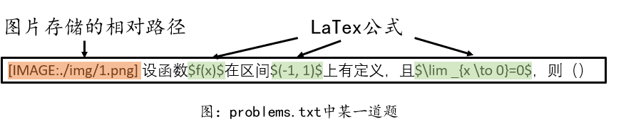

| 贡献           | **李光赫** **21210713** | **邹坤成** **19210215** | **周宇恒** **55210916** | **马周原** **21210613** |
| -------------- | ----------------------- | ----------------------- | ----------------------- | ----------------------- |
| UI设计         | :heavy_check_mark:      | :heavy_check_mark:      | :heavy_check_mark:      | :heavy_check_mark:      |
| 抽题机制       |                         | :heavy_check_mark:      | :heavy_check_mark:      |                         |
| 图片/公式      | :heavy_check_mark:      |                         |                         | :heavy_check_mark:      |
| 题库设计/加载  |                         |                         |                         | :heavy_check_mark:      |
| 状态维护       |                         |                         | :heavy_check_mark:      |                         |
| 报告撰写       | :heavy_check_mark:      | :heavy_check_mark:      | :heavy_check_mark:      | :heavy_check_mark:      |
| ==贡献百分比== | 23%                     | 23%                     | 27%                     | 27%                     |

*贡献百分比按照实现功能数量计算

# 基于C#的抽题系统开发

21210613 马周原

55210916 周宇恒

21210713 李光赫

19210215 邹坤成

### Chapter One - Introduction

在本次作业中，我们组合作设计了一款功能丰富的随机抽题软件，完成了所有要求。
软件拥有UI，放大缩小，选择目录，随机抽题和状态保存等功能，且可以展示包含文本，公式，图片等超文本的题目。
在完成所有要求的基础上，我们的软件也支持子题库功能，可以在软件中选择全部题目/子题库进行展示。

### Chapter Two – Requirement Specifications

- 读取题库：软件应能在多个包含纯文本、图片、公式以及组合格式题目的题库中进行随机抽题操作，所有题库都位于一个可指定的目录下，软件需自动加载该目录下题库中的文本文件作为题目。用户应该可以指定从某个特定题库中抽题或从所有题库中共同抽题。

- 抽题机制：抽题过程需保证随机性，且抽过的题目不能再次出现。
- 显示题目：每次抽取的题目应能在界面上进行显示，并且显示的题目要支持放大和缩小功能，以满足用户不同的查看需求。题目不仅限于展示纯文本，还应能展示一些特殊字符以及超文本内容，如图片和公式。对于以 LaTeX 格式存储的文本，我们能够将其进行读入，并进行公式的显示。其中，该 LaTeX 文本的公式部分由美元符号 dollar 符包裹，未被美元符号包裹的部分正常显示。
- 状态维护：即使软件关闭后重新打开，之前抽过的题目依然要保持不能再次被抽取的状态，除非用户点击了重置按钮。

- UI设计：美观、易懂的UI可以优化用户体验，程序运行时的界面应该包含图标提示、文字提示等信息。

### Chapter Three – Design and Implementations

对应需求写实现方法，截图

- 读取题库
  
  - 题目组织
    - 所有题库都位于一个可指定的目录下（dataset），软件启动时自动加载该目录下所有题库中的文本文件（problems.txt）作为题目。对于一道题目，我们将其保存在txt的一行中，并用特殊格式标注了题目需要图像的相对路径。公式用dollar符表示。
    - 
    - 
  
  - 题库读取
    - 题库读取默认路径为./data，允许用户修改题库路径。
    - 读取的题库会被DataLoader类组织，并对外提供调用接口
    - 
  
- 抽题机制

  - 设计：程序会为每个题目在程序内部进行编号处理。在抽取题目时，利用随机数取模的方法生成下一题的编号。此外，在运行时记录每题是否被抽过，并及时进行重抽，以此保证抽过的题目不会再次出现。
  - 实现：程序将每个题库按名字的字典序排序并分配和题目数量相当的一段编号，题库内部的题目按存储顺序进行编号。抽题时，程序用`RandomNumberGenerator.getNext()%problemCount+1`的方法生成下一题的编号。程序用Dictionary<int, int>来记录每个题目编号出现的次数（0/1），抽完题后，先检查该题目在数组中的标记状态，如果已被抽取则重新进行随机抽取操作，直至抽到未被抽取过的题目。
  - 

- 显示题目
  - 文本和图片
    - 该部分我们使用C#的RichTextBox实现。
    
      **文本显示：**使用RichTextBox的AppendText方法
    
      **图片显示：**若题目中包含图片，则根据相对路径读取，使用 Clipboard.SetDataObject() 方法将图片数据复制到剪贴板上，并Paste到RichTextBox上。
    
    - 
    
  - 公式

    - 在显示公式部分，最大的难点在于 LaTeX 公式的显示需要一个 LaTeX 编译器，并且在 C# 的窗体中无法以文字形式将 LaTeX 公式进行显示。为此，我们的解决方案是用一个 LaTeX 编译器将公式编译并渲染成图片，然后和正常文字进行拼接，并一起显示在窗体上。 其中，编译 LaTeX 的包名为：Aspose.TeX，该包可以将 LaTeX 渲染为图片，并跟文字一起显示在 C# 的窗体当中
    - 
    - 

- 状态维护

  - 设计：为了实现抽题结果的重现，需要实现一个在指定随机种子后结果序列唯一确定的随机算法，这里采用的是Kobayashi提出的混合同余发生器，该随机数发生器周期长，统计特性较好。设计时，除了全题库抽取外，我们还扩展了单题库抽取的功能，并且保证了在切换题库仍然不出现抽过的题目，所以我们采用的状态维护方法是保存随机种子和每个题库的已抽题数量，该状态最大程度地减少了存储的开销。我们的状态信息会在程序关闭前及时存储到`seed.txt`文件中，这个文件会在下一次程序启动后被读取，程序可以通过这个文件恢复之前的抽题情况，确保软件关闭前后抽题过程的连贯性和一致性。
  - 实现：我们实现了一个`RandomNumberGenerator`类，实现了`setSeed`,`reset`,`getSeed`,`getNext`等方法，用于指定种子下随机数的生成和恢复。通过调用这个类，程序可以实现全题库随题和单题库随题。原理方面，一个指定的随机种子唯一确定了所有题目的一个全排列$S$，通过筛选编号范围可以获得不同题库所对应的子序列，令第$i$个题库的子序列为$S_i$。程序保存了每个题库的已抽题数量，令第$i$个题库的已抽题数量为$tot_i$。在选择单个题库$i$进行随机抽题时，程序会令$tot_i$增加一，并获取$S_i$的第$tot_i$个元素的编号作为这次抽题的结果；在选择进行全题库随机抽题时，程序会检查每个题库下一道未取过的题在全排列$S$中的位置，并取在全排列中最靠前的题对应的编号作为这次抽题的结果。

- UI设计

  - 在设计UI时，我们兼顾功能性和美观性，设计了详细的信息提示。

- 代码管理

  - 本项目位于Github（项目地址：https://github.com/zhouyuheng2003/C-sharp-2024），使用Visual Studio配合Git进行多人协作和代码同步，大幅提升了开发效率

### Chapter Four - Analysis

- 优点：软件内容方面，本软件完成了所有既定要求，且在其基础上进行了一定扩展。
  开发方面，本软件使用github进行方便的多人协同工作，大幅提升了开发效率。
- 缺点：ui设计部分使用了现有组件，可以进一步美化。

### Chapter Five - Conclusion

在本次课程设计中，我们团队严格遵循了需求说明文档，不仅按时完成了所有既定需求，还确保了交付的质量。我们采用了GitHub作为代码托管平台，这不仅确保了代码的版本控制和团队协作，还使得任何感兴趣的用户都能够轻松地克隆我们的仓库，并实现一键运行，极大地提高了代码的可访问性和可复用性。

我们有着良好的抽题机制，并且实现了一个用户友好的界面，能够以合理的布局显示带有公式的 LaTeX 源代码，以及各种图像。 

在未来，我们会让我们的界面更加美观，公式的排布更加鲁棒，以及设计出更多能够帮助到用户的插件以及功能，比如说外接一个搜索引擎/大模型实现试时解释，生成新问题，以及搜索答案等功能。

### References

- Kobayashi提出的满周期2^31混合同余发生器